<!-- ====================================================== -->
<!--                    BUILD WITH BALA                     -->
<!--    GitHub Profile README · v3.1 · 2026-05-28           -->
<!-- ====================================================== -->

<div align="center">

<!-- ============ HERO BANNER ============ -->


<br/>

<!-- ============ ANIMATED TYPING ============ -->
<a href="https://github.com/build-with-bala">
  
</a>

<br/><br/>

<!-- ============ ACHIEVEMENTS STRIP ============ -->
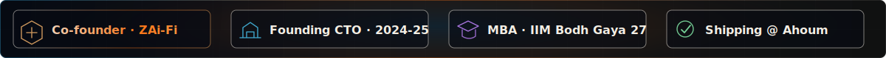

<br/><br/>

<!-- ============ IDENTITY CHIPS ============ -->


<br/>

<a href="https://www.linkedin.com/in/balaji-g-999665190"></a>
&nbsp;
<a href="https://buildwithbala.in"></a>
&nbsp;
<a href="https://www.youtube.com/@buildwithbala"></a>
&nbsp;
<a href="https://instagram.com/buildwithbala"></a>

<br/><br/>

<!-- ============ SHIPPING NOW BADGE ============ -->
<a href="https://seeker.ahoum.com">
  
</a>

<br/>


</div>

<br/>

```ts
const bala = {
  origin:    "Tamil Nadu, India",
  education: "B.Tech CSE @ VIT Chennai → MBA-DBM @ IIM Bodh Gaya '27",
  founded:   "ZAi-Fi (AI evaluation engine for NEET coaching) — Co-founder",
  shipped:   ["hierarchical RAG", "LLM-as-evaluator", "Neo4j knowledge graph", "multi-LLM pipelines"],
  now:       "Building Ahoum @ Neosophical Labs",
  exploring: ["agent architectures", "evaluation systems", "structured reasoning over RAG", "platform economics"],
};
```

<br/>


<br/>

## 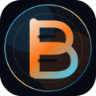 &nbsp; Currently building

<div align="center">

<a href="https://seeker.ahoum.com">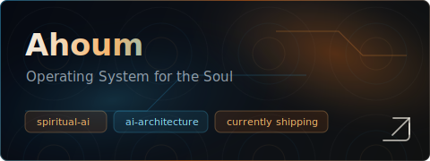</a>
&nbsp;
<a href="https://ecap.iimbg.ac.in/ecap_2025/">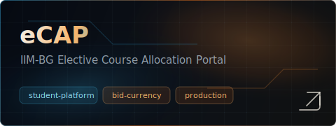</a>

<br/><br/>

<a href="https://github.com/build-with-bala/prep-lab">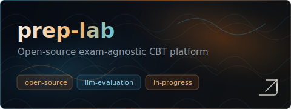</a>
&nbsp;
<a href="https://github.com/build-with-bala/supplylens">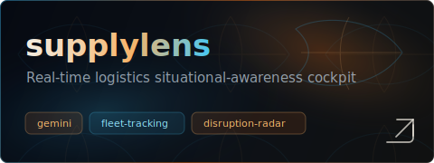</a>

<br/><br/>

<a href="https://github.com/build-with-bala/clan-conqueror-central">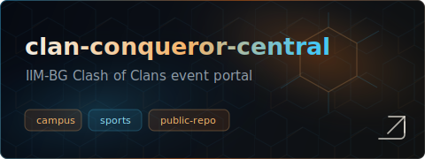</a>
&nbsp;
<a href="https://github.com/build-with-bala/transparent-video-encoder">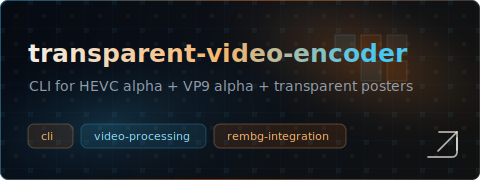</a>

</div>

<br/>


<br/>

##  &nbsp; The stack I actually ship with

<div align="center">

<h4>Languages</h4>


<h4>AI · LLM · Reasoning</h4>


<br/>


<h4>Backend · APIs</h4>


<br/>


<h4>Frontend · Mobile</h4>


<br/>


<h4>Data · Storage</h4>


<br/>


<h4>Cloud · Infra · DevOps</h4>


<br/>


<h4>Analytics · Observability · Growth</h4>


<h4>Tools I live in</h4>


<br/>


<h4>The MBA lens</h4>


</div>

<br/>


<br/>

##  &nbsp; The numbers

<div align="center">

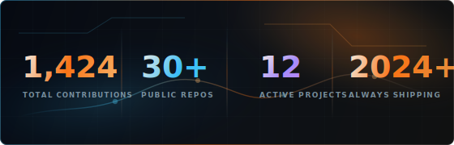
&nbsp;


<br/><br/>

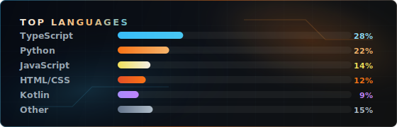
&nbsp;
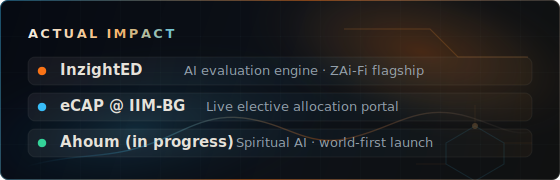

<br/><br/>

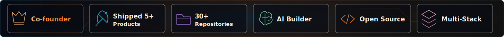

</div>

<br/>


<br/>

##  &nbsp; If you want to reach me

<div align="center">

I'm up for talking about: <b>AI architectures · evaluation systems · founder economics · IIM-BG specifically · what spiritual AI even means</b>.

<br/>

<a href="https://www.linkedin.com/in/balaji-g-999665190">
  
</a>
&nbsp;
<a href="https://buildwithbala.in">
  
</a>

<br/><br/>

<sub>Public admin on <a href="https://github.com/ZAIFI-BUSINESS-SOLUTIONS-PVT-LTD">ZAi-Fi</a> and <a href="https://github.com/Ahoum-Dev">Ahoum-Dev</a>. The real shipping happens there.</sub>

</div>

<br/>

<!-- ============ FOOTER WAVE (dark, brand-aligned) ============ -->

